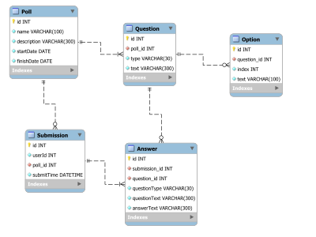

# Опрос пользователей (Django REST Framework)

Задача: спроектировать и разработать API для системы опросов пользователей.

Функционал для администратора системы:

- авторизация в системе (регистрация не нужна)
- добавление/изменение/удаление опросов. Атрибуты опроса: название, дата старта, дата окончания, описание. После создания поле "дата старта" у опроса менять нельзя
- добавление/изменение/удаление вопросов в опросе. Атрибуты вопросов: текст вопроса, тип вопроса (ответ текстом, ответ с выбором одного варианта, ответ с выбором нескольких вариантов)

Функционал для пользователей системы:

- получение списка активных опросов
- прохождение опроса: в качестве идентификатора пользователя в API передаётся числовой ID, по которому сохраняются ответы пользователя на вопросы; один пользователь может участвовать в любом количестве опросов
- получение пройденных пользователем опросов с детализацией по ответам (что выбрано) по ID уникальному пользователя

Использовать следующие технологии: Django 2.2.10, Django REST framework.

Результат выполнения задачи:

- исходный код приложения в github (только на github, публичный репозиторий)
- инструкция по разворачиванию приложения (в docker или локально)
- документация по API

## Как запустить
### Первоначальная установка 
```
cd DRF-Poll-Test
pip install -r requirements.txt
cd backend
python manage.py migrate
python manage.py createsuperuser
```
Создаём супер-юзера с именем admin и паролем admin.
Это имя и пароль будут использоваться в тестах (см. tests/settings.py).

### Запуск сервера
```
cd DRF-Poll-Test/backend
python manage.py runserver
```

### Запуск тестов
Тесты следует запускать при работающем сервере.
```
cd DRF-Poll-Test/tests
pytest
```

## Описание API

См. [API.md](API.md)


## Схема данных


